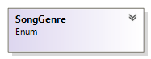
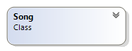

# The Song class

You will be practicing to read from a file and building a relatively
more complex system consisting o the three interconnected types that is
illustrated below:



All the above type must decorated with the public keyword

## The SongGenre enum

This enum comprise of seven types of songs

To code this add a new item to your project and select the class option.
Make the necessary changes to the header to reflect the enum type. You
should decorate this enum with the **Flags** attribute, because values
may be combined e.g. a song may belong to multiple genres such as
Country+Blues.

In order to make the flags work as you would expect, you must set each
value to an ascending power of 2 e.g. 0, 1, 2, 4, 8, 16 … or simply use
the binary values as shown in the diagram below.

<table>
<colgroup>
<col style="width: 100%" />
</colgroup>
<thead>
<tr class="header">
<th><p><strong>SongGenre</strong></p>
<p>Enum</p></th>
</tr>
</thead>
<tbody>
<tr class="odd">
<td><p><strong>Members</strong></p>
<blockquote>
<p>Unclassified = 0</p>
<p>Pop = 0b1</p>
<p>Rock = 0b10</p>
<p>Blues = 0b100</p>
<p>Country = 0b1_000</p>
<p>Metal = 0b10_000</p>
<p>Soul = 0b100_000</p>
</blockquote></td>
</tr>
</tbody>
</table>

If you examine the binary values for each enum, you will notice that
each value has exactly a single value one, therefore as possible value
can only come from a unique combination of the base value.

e.g. 0b1_010 is a result of combining Rock and Country

This acts like a record for the song. The setter is missing for all the
properties

<table>
<colgroup>
<col style="width: 100%" />
</colgroup>
<thead>
<tr class="header">
<th><p><strong>Song</strong></p>
<p>Class</p></th>
</tr>
</thead>
<tbody>
<tr class="odd">
<td><strong>Fields</strong></td>
</tr>
<tr class="even">
<td></td>
</tr>
<tr class="odd">
<td><strong>Properties</strong></td>
</tr>
<tr class="even">
<td><blockquote>
<p>+ «property setter absent» Artist :
<strong><mark>string</mark></strong></p>
<p>+ «property setter absent» Title :
<strong><mark>string</mark></strong></p>
<p>+ «property setter absent» Length :
<strong><mark>double</mark></strong></p>
<p>+ «property setter absent» Genre :
<strong><mark>SongGenre</mark></strong></p>
</blockquote></td>
</tr>
<tr class="odd">
<td><strong>Methods</strong></td>
</tr>
<tr class="even">
<td><blockquote>
<p>+ «constructor» Song(title : <strong><mark>string</mark></strong>,
artist : <strong><mark>string</mark></strong>, length :
<strong><mark>double</mark></strong>, genre :
<strong><mark>SongGenre</mark></strong>)</p>
<p>+ ToString() : <strong><mark>string</mark></strong></p>
</blockquote></td>
</tr>
</tbody>
</table>

### Description of the class members

##### Fields

There are no fields.

##### Properties

This class comprise of four auto-implemented properties with public
getters and setters absent. See the UML class diagram above for more
details.

##### Constructor

**<span class="mark">public</span> Song(string title, string artist,
double length, SongGenre genre)** – This constructor that takes four
arguments and assigns them to the appropriate properties.

##### Method

**<span class="mark">public override string</span> ToString()** – This
public method overrides the **ToString()** method of the object class.
It does not take any argument and returns a string representation of the
object. See the output for hints on the return value of this method.

## The Library class

This is the frontend of the application. This is a static class
therefore all the members also have to be static. Remember class members
are accessed using the type instead of object reference.

<table>
<colgroup>
<col style="width: 100%" />
</colgroup>
<thead>
<tr class="header">
<th><p><strong>Library</strong></p>
<p>Static Class</p></th>
</tr>
</thead>
<tbody>
<tr class="odd">
<td><strong>Fields</strong></td>
</tr>
<tr class="even">
<td><blockquote>
<p>$- songs :
<strong><mark>List</mark></strong>&lt;<strong><mark>Song</mark></strong>&gt;</p>
</blockquote></td>
</tr>
<tr class="odd">
<td><strong>Methods</strong></td>
</tr>
<tr class="even">
<td><blockquote>
<p>$+ LoadSongs(filename : <strong><mark>string</mark></strong>,) :
<strong><mark>void</mark></strong></p>
<p>$+ DisplaySongs() : <strong><mark>void</mark></strong></p>
<p>$+ DisplaySongs(longerThan : <strong><mark>double</mark></strong>) :
<strong><mark>void</mark></strong></p>
<p>$+ DisplaySongs(genre : <strong><mark>SongGenre</mark></strong>) :
<strong><mark>void</mark></strong></p>
<p>$+ DisplaySongs(artist : <strong><mark>string</mark></strong>) :
<strong><mark>void</mark></strong></p>
</blockquote></td>
</tr>
</tbody>
</table>

### Description of class members

#### Fields

**songs** – this private field is a list of song object is a class
variable.

#### Properties

There are no properties.

#### Constructor

There is no constructor for this class.

#### Methods

There are four over-loaded methods. Remember that overloading is a
technique used to reduce the complexity of the API exposed by the Song
class.

Here a foreach loop is recommended for all of the overloaded
DisplaySongs methods.

**<span class="mark">public static</span> <span class="mark">void</span>
DisplaySongs()** – This is a public class method that does not take any
argument and displays all the songs in the collection.

**<span class="mark">public static</span> <span class="mark">void</span>
DisplaySongs(double longerThan)** – This is a public class method that
takes a double argument and displays only songs that are longer than the
argument.

**<span class="mark">public static</span> <span class="mark">void</span>
DisplaySongs(SongGenre genre)** – This is a public class method that
takes a SongGenre argument and displays only songs that are of this
genre.

**<span class="mark">public static</span> <span class="mark">void</span>
DisplaySongs(string artist)** – This is a public class method that takes
a string argument and displays only songs by this artist.

**<span class="mark">public static</span> <span class="mark">void</span>
LoadSongs(string fileName)** – This a class method that is public. It
takes a single string argument that represents a text file containing a
collection of songs. You will read all the data and create songs and add
it to the songs collection. Examine the contents of the files for a
better understanding of how this should be done. You will have to read
four lines to create one Song. Your loop body should have four
ReadLine(). The recipe below might clarify things:

<u>The contents of text file</u>

Baby

Justin Bebier

3.35

Pop

- Initialize the songs field to a new List of Song

- Declare four string variable (title, artist, length, genre) to store
  the results of four reader.ReadLine().

- The first ReadLine() is a string representing the title of the song.
  This can and should used as a check for termination condition. If this
  is empty then there are no more songs to read i.e. it is the end of
  the file

- The next ReadLine() will get the Artist

This is a complex method and rightfully it should be a part of the
**Song** Class

- The next ReadLine() will be a string that represents the weight. Use
  the Convert.ToDouble to get the required type

- The next ReadLine() will be a string that represents the genre. Use
  the Enum.Parse() to get the required type

- Use the above four variables to create a Song object.

- Add the newly created object to the collection.

- And finally do one more read for the title to re-enter the loop.

P.S. Before running the <span class="mark">Library.LoadSongs()</span>
you will need to copy the files Week_03_lab09_song.txt,
Week_03_lab09_song2.txt, Week_03_lab09_song3.txt and
Week_03_lab09_song4.txt to the bin\debug folder.

### Test Harness

Insert the following code statements in the **Main()** method of your
Program.cs file:

``` cs
//To test the constructor and the ToString method

Console.WriteLine(new Song("Baby", "Justin Bebier", 3.35, SongGenre.Pop));

//This is first time that you are using the bitwise or. It is used to specify a combination of genres

Console.WriteLine(new Song("The Promise", "Chris Cornell", 4.26, SongGenre.Country | SongGenre.Rock));

Library.LoadSongs("Week_03_lab_09_songs4.txt"); //Class methods are invoke with the class name

Console.WriteLine("\n\nAll songs");

Library.DisplaySongs();

SongGenre genre = SongGenre.Rock;

Console.WriteLine($"\n\n{genre} songs");

Library.DisplaySongs(genre);

string artist = "Bob Dylan";

Console.WriteLine($"\n\nSongs by {artist}");

Library.DisplaySongs(artist);

double length = 5.0;

Console.WriteLine($"\n\nSongs more than {length}mins");

Library.DisplaySongs(length);

```

Program output

``` txt
Baby by Justin Bebier (Pop) 3.35min

The Promise by Chris Cornell (Rock, Country) 4.26min

All songs

Baby by Justin Bebier (Pop) 3.35min

Fearless by Taylor Swift (Pop) 4.03min

Runaway Love by Ludacris (Pop) 4.41min

My Heart Will Go On by Celine Dion (Pop) 4.41min

Jesus Take The Wheel by Carrie Underwood (Country) 3.31min

If Tomorrow Never Comes by Garth Brooks (Country) 3.40min

Set Fire To Rain by Adele (Soul) 4.01min

Don't You Remember by Adele (Soul) 3.03min

Signed Sealed Deliverd I'm Yours by Stevie Wonder (Soul) 2.39min

Just Another Night by Mick Jagger (Rock) 5.15min

Brown Sugar by Mick Jagger (Rock) 3.50min

All I Want Is You by Bono (Metal) 6.30min

Beautiful Day by Bono (Metal) 4.08min

Like A Rolling Stone by Bob Dylan (Rock) 6.08min

Just Like a Woman by Bob Dylan (Rock) 4.51min

Hurricane by Bob Dylan (Rock) 8.33min

Subterranean Homesick Blues by Bob Dylan (Rock) 2.24min

Tangled Up In Blue by Bob Dylan (Rock) 5.40min

Love Me by Elvis Presley (Rock) 2.42min

In The Getto by Elvis Presley (Rock) 2.31min

All Shook Up by Elvis Presley (Rock) 1.54min

Rock songs

Just Another Night by Mick Jagger (Rock) 5.15min

Brown Sugar by Mick Jagger (Rock) 3.50min

Like A Rolling Stone by Bob Dylan (Rock) 6.08min

Just Like a Woman by Bob Dylan (Rock) 4.51min

Hurricane by Bob Dylan (Rock) 8.33min

Subterranean Homesick Blues by Bob Dylan (Rock) 2.24min

Tangled Up In Blue by Bob Dylan (Rock) 5.40min

Love Me by Elvis Presley (Rock) 2.42min

In The Getto by Elvis Presley (Rock) 2.31min

All Shook Up by Elvis Presley (Rock) 1.54min

Songs by Bob Dylan

Like A Rolling Stone by Bob Dylan (Rock) 6.08min

Just Like a Woman by Bob Dylan (Rock) 4.51min

Hurricane by Bob Dylan (Rock) 8.33min

Subterranean Homesick Blues by Bob Dylan (Rock) 2.24min

Tangled Up In Blue by Bob Dylan (Rock) 5.40min

Songs more than 5mins

Just Another Night by Mick Jagger (Rock) 5.15min

All I Want Is You by Bono (Metal) 6.30min

Like A Rolling Stone by Bob Dylan (Rock) 6.08min

Hurricane by Bob Dylan (Rock) 8.33min

Tangled Up In Blue by Bob Dylan (Rock) 5.40min

Press any key to continue . . .
```
